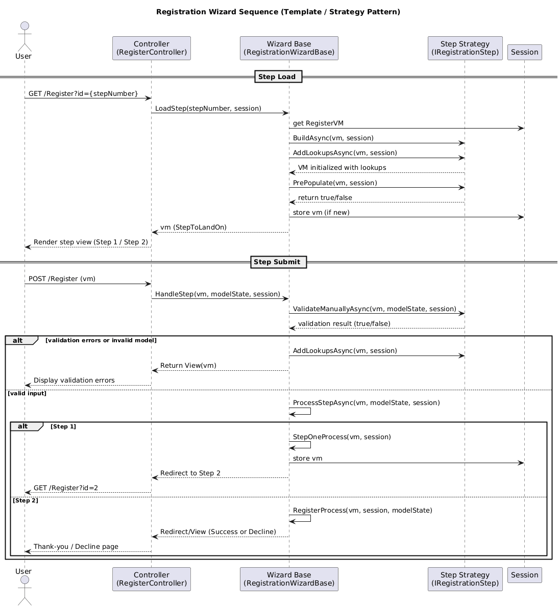

# URL Scanner Package
A lightweight, framework-agnostic PHP package to scan large lists of URLs efficiently using chunked asynchronous processing.
Designed for use inside Laravel commands or any PHP application where non-blocking URL checking is required
<a href="https://fperdomo.dev/">
<picture>

</picture>
</a>
## use

```php

use Fperdomo\App\Url\Scanner;

$urls = Scanner::create()
->fromArray([
    'https://example.com',
    'https://another-example.com',
])->getInvalidUrls();

```

From a file:

```php

use Fperdomo\App\Url\Scanner;

$scanner = Scanner::create()
->fromFile('url.csv')
->onProgress(funtion ($progress) {);
    // show progress
    print_r('');
    print_r('========================================');
    print_r(sprintf('Total URLs processed: %d', $progress->totalRowsProcessed));
    print_r(sprintf(
        'Valid URLs: %d (%.1f%%)',
        $progress->resultsOk,
        $progress->validPercentage()
    ));
    print_r(sprintf(
        'Invalid URLs: %d (%.1f%%)',
        $progress->resultsErr,
        $progress->invalidPercentage()
    ));
    print_r('========================================');
});
Benchmark::dd(fn () => $scanner->scan());
```

From a file async:

```php

use Fperdomo\App\Url\Scanner;

$urls = Scanner::create()
->fromFile('url.csv')
->field('url')
->chunk(1000)
->onProgress(funtion ($progress) {);
    // show progress
    print_r('');
    print_r('========================================');
    print_r(sprintf('Total URLs processed: %d', $progress->totalRowsProcessed));
    print_r(sprintf(
        'Valid URLs: %d (%.1f%%)',
        $progress->resultsOk,
        $progress->validPercentage()
    ));
    print_r(sprintf(
        'Invalid URLs: %d (%.1f%%)',
        $progress->resultsErr,
        $progress->invalidPercentage()
    ));
    print_r('========================================');
});
Benchmark::dd(fn () => $scanner->scan());
```
